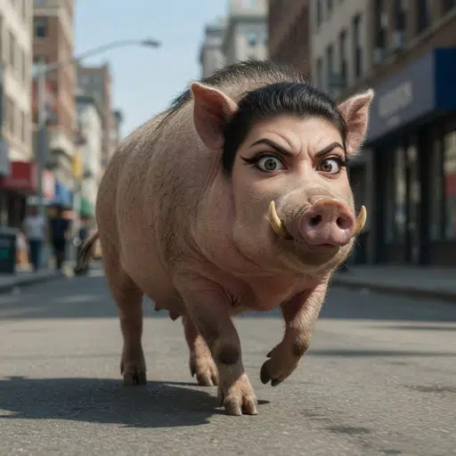

# BOARIFY 🐗

Transform yourself into a wild boar with AI.

Upload a photo → AI boarifies you → Download your new identity.



## How It Works

1. Upload a photo of yourself (or anyone, we don't judge)
2. Our AI analyzes the photo and reference boar images
3. You get back a glorious boar-human hybrid
4. Share it. Embrace the boar within.

## Tech Stack

- **Next.js 14** (App Router)
- **TypeScript** + **Tailwind CSS**
- **OpenAI gpt-image-2** for image transformation
- Reference images as style vectors

## Setup

```bash
# Clone
git clone https://github.com/ciberneticatradingdev/boarify.git
cd boarify

# Install
npm install

# Set your OpenAI API key
cp .env.example .env.local
# Edit .env.local and add your OPENAI_API_KEY

# Run
npm run dev
```

Open [http://localhost:3000](http://localhost:3000)

## Environment Variables

| Variable | Description |
|----------|-------------|
| `OPENAI_API_KEY` | Your OpenAI API key (needs gpt-image-2 access) |

## Deploy

Works out of the box on Vercel:

[](https://vercel.com/new/clone?repository-url=https://github.com/ciberneticatradingdev/boarify)

## License

MIT — do whatever you want, just don't blame us if you can't stop boarifying people.
